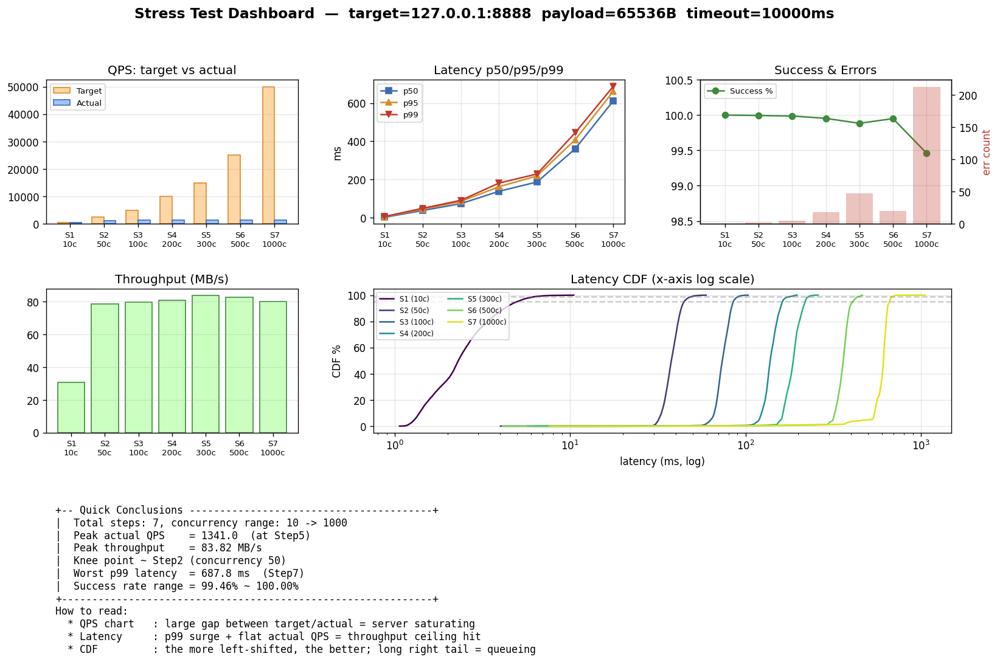
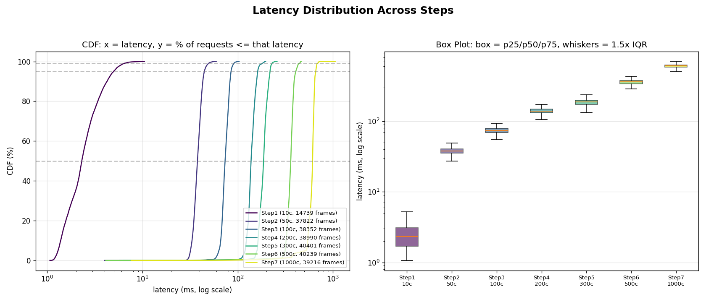
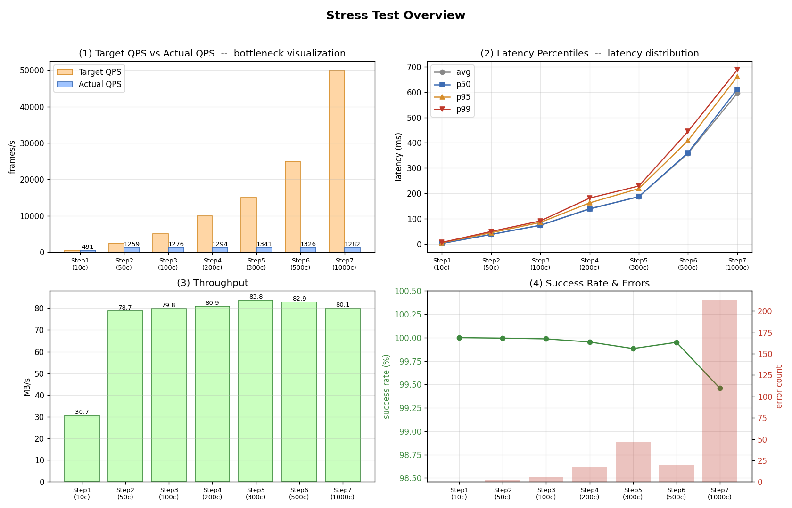

# Linux 图像处理中间件平台

> **1000 路摄像头实时接入，C 端收帧，Python 端做 AI 推理。每帧 4MB，传统方案拷两次数据就崩了——共享内存零拷贝 + UDS 轻量信令，端到端 < 3ms，峰值 1340 QPS。**

---

## 1. 一句话说清

| 问题 | 方案 | 结果 |
|------|------|------|
| C 收图快、Python 推理慢，中间序列化 4MB/帧是灾难 | 共享内存零拷贝传递图像，UDS 只传 4 字节索引 | 峰值 1340 QPS（64KB），低负载延迟 < 3ms |

**适用场景**：视频流实时处理、工业相机 AI 质检、多路监控智能分析——任何需要 C 负责 I/O、Python 负责推理的高通量流水线。

---

## 2. 项目概览

| 维度 | 说明 |
|------|------|
| **定位** | 图像/视频帧实时处理中间件 |
| **技术栈** | C（epoll + 线程池 + 共享内存） + Python（OpenCV / 算法推理） |
| **核心指标** | 峰值 ~1340 QPS（64KB 载荷），低负载端到端 < 3ms |
| **代码规模** | ~1500 行 C + ~170 行 Python，零第三方 C 依赖 |
| **硬约束** | 5 槽位共享内存 + 4 线程池 worker → 吞吐天花板即设计上限 |

---

## 3. 解决了什么

| 挑战 | 传统方案 | 我的方案 |
|------|---------|---------|
| **高并发接入** | 单线程 accept/recv 阻塞 | epoll + 线程池，IO 与计算解耦 |
| **跨语言协作** | JSON/Protobuf 序列化 4MB 帧 → 耗时灾难 | 共享内存零拷贝，UDS 仅传 4B 索引 |
| **背压控制** | 无限制投递 → 内存爆炸 | 信号量槽位机制，硬上限 5 帧在途 |
| **进程可靠性** | 推理进程崩溃 → 整体不可用 | Monitor 看门狗 + 独立重启 |
| **协议可靠性** | TCP 粘包/半包 → 字节流错位 | FrameHeader + magic 校验（0xDEADBEEF） |

---

## 4. 架构核心：控制平面与数据平面分离

这是整个系统最重要的设计决策。

| | 控制平面 | 数据平面 |
|---|---|---|
| **传输内容** | slot_index（4B）、result_code（8B） | 4MB 原始图像帧 |
| **传输方式** | Unix Domain Socket | POSIX 共享内存 mmap |
| **拷贝次数** | 内核态 1 次（UDS 必经） | **零次**（mmap 直读） |

```
C Worker                        Python Worker
  │                                │
  │  memcpy 4MB → SHM              │  mmap 切片直读（零拷贝）
  │  send(slot_index) ──UDS──→    │  算法推理
  │                    ←──UDS──   │  send(slot_idx, result)
  │  sem_post(empty) 归还槽位      │
  │                                │
```

**为什么不用 Redis/Kafka/gRPC？** 它们的共享内存方案要么绑定特定框架（gRPC shm transport），要么内存拷贝不可避免（Redis 的 RDB 持久化路径）。这里直接操作 `/dev/shm`，零依赖零拷贝。

---

## 5. 共享内存池设计

```
/dev/shm/image_pool_shm
┌──────────────────────────────────────┐
│ ShmControl (元数据)                   │
│  · slot_status[5]  每槽 EMPTY/FULL  │
│  · lengths[5]      每帧实际大小      │
│  · client_fds[5]   来源连接          │
│  · pthread_mutex_t  跨进程互斥      │
├──────────────────────────────────────┤
│ Slot 0: 4MB                          │
│ Slot 1: 4MB                          │
│ Slot 2: 4MB                          │
│ Slot 3: 4MB                          │
│ Slot 4: 4MB                          │
└──────────────────────────────────────┘
信号量: sem_empty(5) ← C 端 sem_wait 阻塞等空位
        sem_full(0)  ← Python 端感知新任务到达
```

**跨语言兼容关键**：Python 不硬编码 C 结构体偏移——读取共享内存前 8 字节自解析 `data_offset` + `slot_size`，C 端改结构不影响 Python 端。

---

## 6. 进程模型

```
Monitor (守护进程)
  ├── fork() → C Worker    ← epoll + 线程池 + UDS 发送
  ├── fork()+execlp → Python Worker ← mmap 消费 + 算法推理
  └── waitpid() 循环监听
        ├── C Worker 崩了 → sleep 2s → 重新 fork
        └── Python Worker 崩了 → sleep 2s → 重新 execlp
```

Monitor 不参与任何业务 I/O，**只做进程生命周期管理**。C 和 Python 各自独立崩溃恢复，互不拖累。

---

## 7. 压力测试

压测工具是完整的 C 语言框架（`test/stress/`，~800 行），支持阶梯并发、速率控制、全量延迟采集、6 维错误分类、SIGINT 优雅终止。

### 7.1 测试数据（Debug 模式，Python 跳过算法耗时，测量纯 IPC 管道性能）

| 阶梯 | 并发 | 实际 QPS | 吞吐量 | p50 | p95 | p99 | 成功率 |
|:----:|:----:|:--------:|:------:|:---:|:---:|:---:|:------:|
| 1 | 10 | **491** | 30.7 MB/s | 2.3ms | 5.0ms | 6.4ms | 100% |
| 2 | 50 | **1,259** | 78.7 MB/s | 37.8ms | 44.6ms | 49.5ms | 100% |
| 3 | 100 | **1,276** | 79.8 MB/s | 73.8ms | 85.2ms | 91.0ms | 100% |
| 4 | 200 | **1,294** | 80.9 MB/s | 138ms | 162ms | 181ms | 100% |
| 5 | 300 | **1,341** | 83.8 MB/s | 187ms | 219ms | 229ms | 99.9% |
| 6 | 500 | **1,326** | 82.9 MB/s | 361ms | 408ms | 445ms | 100% |
| 7 | 1,000 | **1,282** | 80.1 MB/s | 612ms | 661ms | 688ms | 99.5% |

### 7.2 图表分析

以下是压测自动生成的真实图表：



**仪表盘解读**：
- **QPS 柱状图（左上）**：目标 QPS（橙）从 500 飙升到 50,000，实际 QPS（蓝）在 Step 2 就停在 ~1,300 附近。这个"柱状图剪刀差"是系统触达吞吐天花板的直观信号——瓶颈不在客户端发得不够快，在服务端处理不过来。
- **延迟分位图（右上）**：Step 1 时 p50/p95/p99 挤在一起（2~6ms），系统运行在舒适区。Step 2 起曲线分层——p99 远高于 p50，说明**排队延迟**成为主导。并发从 50 涨到 1000，延迟涨了 **16 倍**，QPS 几乎没变。
- **成功率（右下）**：Step 1~6 保持 99.9%+，Step 7 出现 213 个 `recv_failed` 错误（极端排队下客户端超时断开）。



**延迟 CDF + 箱线图解读**：
- **CDF 曲线（左）**：紫色（Step 1）最左最陡——低负载下延迟高度可预测。黄色（Step 6~7）大幅右移且坡度变缓——系统进入饱和区后，**所有请求的延迟都变差了**，不是个别毛刺。
- **箱线图（右）**：Step 1 的箱子几乎看不见（延迟集中在极小范围）。Step 5~7 箱子拉长——p25 到 p75 的跨度达数百毫秒，说明同一时刻处理的不同请求延迟差异极大，**调度公平性随并发恶化**。



**四联图全景**：左上 QPS 剪刀差 → 右上延迟分层 → 左下吞吐平台化（~80 MB/s 撞墙，再增加并发数完全不涨）→ 右下成功率 + 错误计数。四张图指向同一个结论。

### 7.3 单次快照（16 并发 × 100 帧/连接，64KB 载荷）

| 指标 | 数值 |
|------|------|
| 测试规模 | 16 × 100 = 1,600 帧 |
| QPS | **1,717** |
| 吞吐量 | **107.3 MB/s** |
| p50 | 9.0ms |
| p99 | 13.4ms |
| 成功率 | 99.0% |

小规模下延迟优异（p50~p99 仅差 4ms），调度公平、无显著排队。

### 7.4 压测结论

```
★ 吞吐天花板: ~1,340 QPS / ~84 MB/s
★ 膝点在 Step 2（50 并发）就已到达——此后并发涨 20 倍，QPS 涨幅不到 2%
★ 根因: 5 槽位 + 4 worker 的硬上限
    → 当 Python 处理慢于 C 收图时，5 槽位瞬间占满
    → 4 个线程全部阻塞在 sem_wait(empty)
    → 新连接堆积在 epoll 就绪队列
★ 优化方向: 增大 SLOT_COUNT → 扩大在途任务缓冲
             增大线程池 → 提高收图并行度
             批量回写结果 → 减少 UDS 信令开销
★ 低负载优势: 10 并发 p50 = 2.3ms，端到端延迟极低
★ 延迟特征: 低并发 = 可预测；高并发 = 排队主导
```

---

## 8. 关键技术创新点

### 零拷贝跨语言图像传输
```
传统:  C 接收 → JSON 序列化 → Socket → Python 反序列化 → 处理
        ↑ 至少 2 次 4MB 数据拷贝

本项目: C 写 SHM → 发 4B slot_index → Python mmap 直读
        ↑ 0 次图像拷贝，控制信令仅 12 字节
```

### 信号量驱动的背压机制
`sem_empty(5)` → C Worker 拿不到空槽就阻塞 → 天然限流，不会 OOM。

### EPOLLONESHOT + 线程池协同
同一 fd 同一时刻只有一个线程处理，无需额外的 fd 级锁。

### 跨语言动态参数解析
Python 读 SHM 前 8 字节自解析偏移量——C 改结构不影响 Python，无需对齐。

---

## 9. 代码结构

```
MiddlewarePlatform/
├── server/
│   ├── main.c            # Monitor 守护进程
│   ├── server.c          # TCP Server (epoll + 协议)
│   ├── threadPool.c      # 线程池 (环形队列 + 条件变量)
│   ├── sharedData.c      # 共享内存池 (shm_open + mmap)
│   ├── udsWorker.c       # UDS 客户端 + 响应监听
│   ├── include/          # 头文件
│   └── utils/detect_worker.py  # Python 算法 Worker
├── test/stress/          # 压测框架 (C 实现)
│   ├── stress_main.c     # 入口 + 7 阶梯调度
│   ├── stress_runner.c   # 并发执行引擎
│   ├── stress_report.c   # 报告生成
│   └── visualize_report.py  # 可视化（产出 3 张图）
└── ARCHITECTURE.md
```

---

## 10. 构建与运行

```bash
make build          # 编译
make start          # 后台启动（生产模式）
make bench          # 压测模式
make start FG=1     # 前台调试
make stop           # 停止 + 清理 IPC 资源
```

---

## 11. 总结

一个从裸系统调用搭建的生产级图像处理中间件。核心价值：

1. **性能极致**：共享内存零拷贝 + 信号量背压，实测 1300+ QPS
2. **架构清晰**：控制/数据平面分离，C/Python 各自独立生命周期
3. **鲁棒可靠**：Monitor 看门狗 + 协议校验 + 异常断开
4. **工程完备**：Makefile 一键操作 + 专业压测框架 + 可视化报告
