# 支持RV32I指令集的RISC-V多周期CPU的设计与FPGA实现

> **项目总览:** 设计并实现了一款支持 RV32I 基础指令集的 RISC-V 多周期 CPU，完成基于 AXI4 总线的全套片上系统（SoC）集成，并搭建了从”底层 RTL 硬件 → 闭环验证 → Bootloader 引导 → C代码”的全栈工程生态。

## 设计演进：从单周期原型到多周期架构

在构建多周期处理器之前，首先实现了一个**单周期处理器原型**作为**ALU**和**指令解码器**以及**数据通路**的基本验证，单周期处理器即所有指令在一个时钟周期内完成，包含 PC 寄存器、指令存储器、译码单元、32×32 位寄存器堆、ALU 及数据存储器等核心模块。通过该原型快速验证了 RV32I 全部 40 条指令的控制通路正确性。
随后演进为基于 Valid-Ready 握手协议的**多周期架构**，将指令执行划分为取指（IF）、译码（ID）、执行（EX）、访存（MEM）、写回（WB）五个阶段。相比传统的集中式硬连线状态机，这种模块化重构有效缩短了关键组合逻辑路径、缓解了时序压力，为 SoC 集成中应对不确定访存延迟提供了天然的流水线暂停机制。


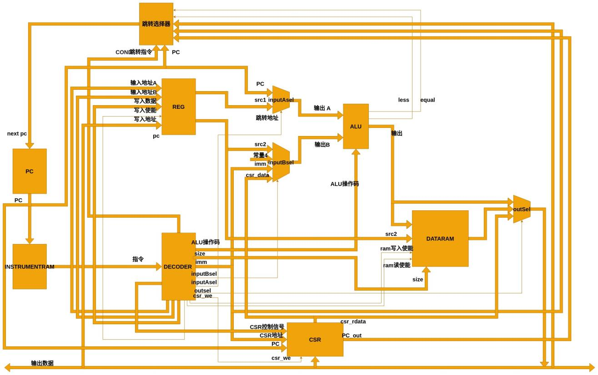


## 核心技术与微架构亮点

### 基于 Valid-Ready 握手协议的模块化重构

- **架构演进**：放弃传统的集中式硬连线状态机，采用 **Valid-Ready 双向握手协议** 对取指（IFU）、译码（IDU）、执行（EXU）、访存（LSU）、写回（WBU）五大核心单元进行深度解耦。
- **高容错与反压机制**：各阶段通过状态组合自主协商数据传输，实现了天然的反压机制。面对外设高延迟或总线阻塞时，可实现周期精确级的流水线暂停控制，极大地提高了架构的演进上限。

### 异步/变延迟访存的状态机（FSM）设计

- **IFU 状态机**：设计 4-State 读数据有限状态机，精确控制 AXI4 读地址/读数据通道的握手时序，实现指令流的稳态供给。

    - `S_IDLE → S_AR`：接收上层 Valid 信号，锁存当前 PC 值
    - `S_AR → S_R`：向 AXI4 总线发送读地址，等待 arvalid/arready 握手完成
    - `S_R → S_OUT`：等待存储器的读数据返回，rvalid/rready/rlast 同时有效时锁存指令
    - `S_OUT → S_IDLE`：将 PC 和指令发送至下游译码单元，完成一次取指周期

- **LSU 状态机**：针对总线延迟不确定性，设计 **7-State 读写分离有限状态机**。内嵌硬件自动对齐与符号扩展逻辑，支持 `LB/LH/LW/LBU/LHU` 与 `SB/SH/SW` 等全类型非对齐/部分字节访存，精准生成 `wstrb` 字节使能掩码。

    - **读通道**：`S_IDLE → S_AR(发送读地址) → S_R(等待数据) → S_OUT(输出结果)`
    - **写通道**：`S_IDLE → S_AW(发送写地址) → S_W(发送写数据) → S_B(等待写响应) → S_OUT`
    - **直通通道**：非访存指令直接 `S_IDLE → S_OUT`，优化吞吐效率
    - Load 指令根据地址低 2 位 `addr[1:0]` 自动移位对齐，按 `LB/LH/LW/LBU/LHU` 类型做符号/无符号扩展
    - Store 指令根据数据大小生成 `wstrb` 字节使能掩码（如 SB: `4'b0001 << addr[1:0]`，SW: `4'b1111`）

### 统一总线架构与 AXI4 仲裁器设计

- **工业级总线集成**：内核作为 AXI Master，采用标准 AXI4/AXI4-Lite 协议挂载 UART (16550 规范)、Boot BRAM、SPI Flash 及外部 PSRAM/DDR。
- **硬件总线仲裁**：设计了固定优先级/时分复用的 AXI4 总线仲裁器，高效协调单发射架构下 IFU（指令取指）与 LSU（数据读写）对单一总线主端口的竞争，确保 LSU 访存的高优先级与总线零死锁。

## 闭环验证体系与工程调试能力

### 基于 Verilator + NEMU 的指令级差分测试 (Difftest)

- **高性能编译仿真**：抛弃传统慢速事件驱动仿真器，利用 **Verilator** 将 RTL 静态编译为 C++ 模型，实现 MIPS 级别的超高吞吐仿真。
- **参考模型逐拍比对**：将 C++ 化的 NEMU 作为参考模型（Reference Model），通过 DPI-C 接口接入仿真框架。在每一个 clock cycle 之后，自动触发自研 CPU 与 NEMU 的 **32 个通用寄存器（GPRs）、CSR 及 PC 状态的逐位比对**，实现 Bug 现场的瞬间定位。

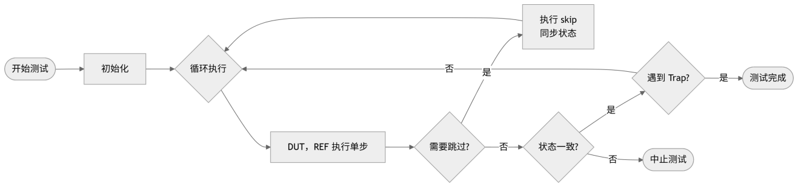

### 2.2 自研宿主机调试器 SDB (Simple Debugger)

SDB 运行于宿主机，与 Verilator 生成的 C++ 仿真模型深度集成，构建了一个透明、可控的指令级观测平台。主要交互逻辑如下图所示。

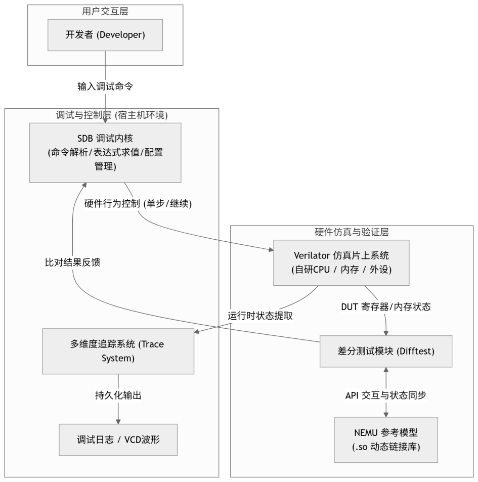

- **架构设计**：模块化分层设计，`sdb/` 为调试核心层（表达式求值引擎 + 命令循环），`cpu/` 为 CPU 状态管理层（维护处理器状态 + 协调差分测试），`interfaces/` 为数据交互层（Verilator DPI-C 接口 + NEMU 动态链接库接口），`trace/` 为追踪层（ITRACE / MTRACE / DTRACE）。

- **表达式求值引擎**：基于递归下降分析法，通过词法扫描器 + 递归下降解析器实现。支持寄存器引用（`$sp`、`$ra`）、算术运算、内存解引用，可动态计算任意表达式并修改寄存器或内存单元。并且通过**随机生成测试用例**的功能验证

- **指令追踪与差分测试集成**：集成 **ITRACE（指令追踪）、MTRACE（访存追踪）、DTRACE（设备追踪）**，基于 Kconfig 引入图形化模块配置，实现调试开销与仿真吞吐率的动态平衡。

- **核心命令集**：

| 命令 | 功能 | 示例 |
|---|---|---|
| `help` | 显示帮助信息 | `help` |
| `c` | 连续执行程序 | `c` |
| `q` | 退出 SDB | `q` |
| `si [N]` | 单步执行 N 条指令 | `si` 或 `si 10` |
| `info r` | 显示全部 GPR + PC | `info r` |
| `x N addr` | 扫描内存 N 个连续字 | `x 10 0x80000000` |
| `p expr` | 表达式求值 | `p $sp + 4` |

**CPU 状态管理**：通过 `CPUState` 枚举类实现处理器运行状态的精确管理：

```cpp
enum class CPUState { RUNNING, HALTED, ABORTED, IDLE };
```

当处理器执行 `ebreak` 指令或触发异常时，通过 `trap()` 接口转入 HALTED 状态，开发者可全面检查系统状态。

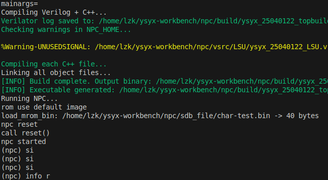

下图为系统详细逻辑过程图。

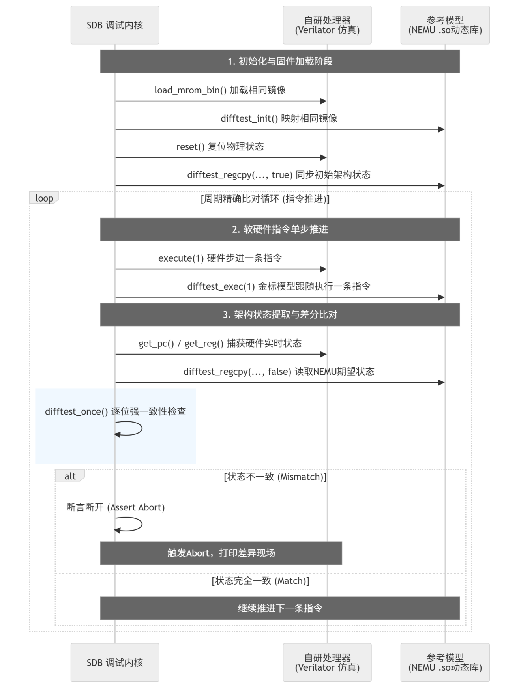


## 嵌入式软件栈与系统引导 

### “BootROM + Bootloader” 两阶段启动架构

- **存储拓扑与硬件寻址**：设置 Reset Vector 为片上 BRAM (`0x2000_0000`)，上电/复位后 PC 硬件强制跳转至该地址执行。

- **两阶段启动流程**：

    1. **Stage 1 — 片上 BRAM 执行 Bootloader**：栈指针初始化（`la sp, _stack_top`）→ `.bss` 段手动清零（根据 `_bss_start` / `_bss_end` 链接符号边界）→ 激活 AXI Quad SPI 控制器
    2. **Stage 2 — 镜像搬运与控制权转移**：Bootloader 以 32-bit 宽度从 SPI Flash（`0x3000_0000`）搬运应用程序至 PSRAM（`0x8000_0000`），通过 Memory-Mapped IO 方式直接读取 Flash 地址空间，无需复杂的外设驱动协议，搬运完成后以 C 语言函数指针实现受控上下文跳转：`((void (*)(void))0x80000000)();`

- **分离式编译布局**：Bootloader 与应用程序采用独立的 Linker Script 分别编译。Bootloader 链接至 `0x2000_0000`（BRAM 地址空间），应用程序链接至 `0x8000_0000`（PSRAM 地址空间），两者通过 SPI Flash 上的镜像文件建立耦合关系。

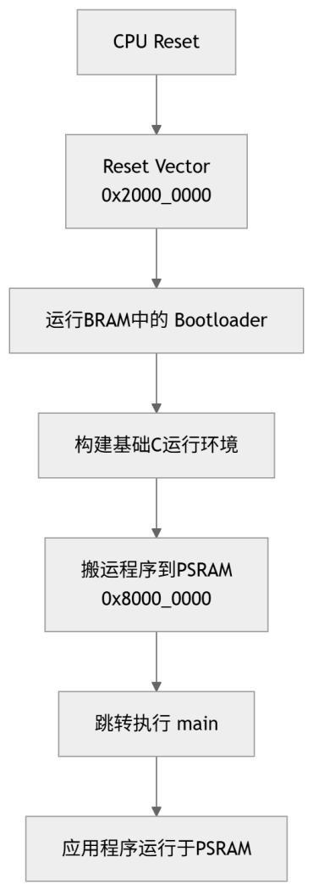

### 3.2 全套工具链与抽象层构建

- 深入配置 `riscv64-linux-gnu-gcc` 交叉编译工具链，针对无 OS 环境定制编译参数：

| 参数 | 含义 |
|---|---|
| `-march=rv32i` | 目标架构 RV32I 基础整数指令集 |
| `-mabi=ilp32` | 32 位整数 ABI（int/long/指针均为 32 位） |
| `-nostdlib` | 禁止链接标准 C 运行时库 |
| `-nostartfiles` | 禁止链接标准启动文件 |
| `-ffreestanding` | 声明独立运行环境（bare-metal） |
| `-O2` | 中等优化，平衡性能与可调试性 |

- 编写独立 Linker Script（分离开引导区与应用区内存布局），实现硬件 Stack Pointer 手动初始化与 `.bss` 段清零。由于无 OS 环境，C 语言运行所需的栈空间、全局变量初始化等均需 Bootloader 手动完成。

### SoC 系统地址映射与外设集成

基于 AXI4-Lite 总线协议，构建统一地址空间的多级存储 SoC 系统：

| 地址范围 | 设备 | 大小 | 说明 |
|---|---|---|---|
| `0x1000_0000` - `0x1000_0FFF` | UART | 4KB | 16550 寄存器规范，支持 16 字节发送/接收 FIFO，可配置波特率 |
| `0x2000_0000` - `0x2000_0FFF` | BRAM（Boot ROM） | 4KB | 片上启动存储器，PC 复位向量地址 |
| `0x3000_0000` - `0x37FF_FFFF` | SPI Flash | 128MB | 外部非易失性存储，存放应用程序固件镜像 |
| `0x8000_0000` - `0x9FFF_FFFF` | PSRAM / DDR | 512MB | 外部主内存，应用程序运行空间 |

UART 外设实现 16550 兼容的寄存器映射：

| 偏移 | 名称 | 读写 | 功能 |
|---|---|---|---|
| `0x00` | TX/RX DATA | W/R | 发送/接收数据寄存器 |
| `0x04` | INT EN | R/W | 中断使能控制 |
| `0x08` | FIFO STATUS | R | FIFO 状态（发送空/接收满等） |
| `0x0C` | LINE CTRL | R/W | 线控（数据位宽、停止位、波特率分频） |

在 50MHz 系统时钟下，115200 波特率对应的分频系数约为 434。通信格式为 1 起始位 + 8 数据位 + 1 停止位，无校验位。

## FPGA 实现与系统综合指标

### 硬件平台与开发环境

- **硬件载体**：Xilinx Artix-7 FPGA (`XC7A35T-1FTG256C`)
- **开发环境**：AMD Vivado — IP Integrator (Block Design) + Synthesis + Implementation + Hardware Manager
- **HDL 语言**：Verilog HDL
- **总线协议**：AXI4 / AXI4-Lite
- **验证方式**：Verilator 仿真 + NEMU 差分测试 + SDB 调试 + FPGA 板级实测

### Vivado Block Design 系统集成

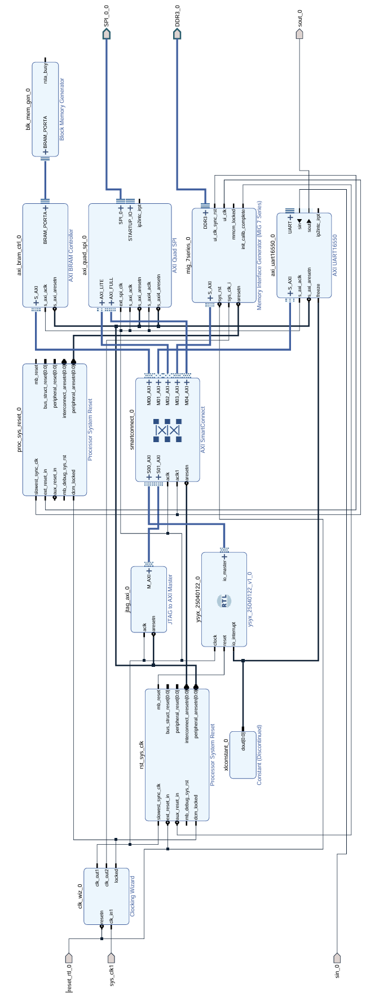
基于 Vivado IP Integrator 图形化平台搭建 SoC 异构系统，通过 Block Design 方式自动处理 AXI 总线互联、时钟同步、地址映射与复位信号控制：


| IP 模块 | 功能 |
|---|---|
| **Clock Wizard** | 生成系统时钟、AXI 总线时钟、DDR 控制器时钟等多路内部时钟 |
| **Processor System Reset** | 外部复位信号同步化，生成 AXI 互联复位与外设复位 |
| **AXI SmartConnect** | 多路从设备自动仲裁与路由 |
| **AXI BRAM Controller** | 4KB 片上 BRAM 作为 Boot ROM，复位向量 `0x2000_0000` |
| **AXI Quad SPI** | 外部 SPI Flash 存储器映射访问（`0x3000_0000`） |
| **MIG 7 Series** | DDR/PSRAM 内存控制器接口（`0x8000_0000`） |
| **AXI UART16550** | 串行通信外设（`0x1000_0000`） |

CPU 作为 AXI Master，IFU（指令取指）与 LSU（数据读写）的访存请求统一经 AXI SmartConnect 进行仲裁与路由，实现了标准化的多级存储 SoC 架构。

### Synthesis 与 Implementation 流程

1. **RTL 综合（Synthesis）**：将 Verilog 硬件描述转换为门级网表，全语法检查通过
2. **布局布线（Implementation）**：将网表映射至 XC7A35T 芯片的物理 Slice 与布线通道
3. **比特流生成（Bitstream）**：生成 `.bit` 格式硬件配置文件
4. **JTAG 烧录**：通过 Vivado Hardware Manager 经 JTAG 接口下载至 FPGA
5. **固件固化**：将应用程序 `.bin/.mcs` 镜像烧录至 SPI Flash，实现掉电不丢失、上电自动加载

### 核心运行指标

#### 主频性能
稳定运行于 **50 MHz** 时钟频率下（时钟周期 20 ns）。

#### 资源利用率（极低面积开销）

| 资源类型 | 利用率 |
|---|---|
| **Slice LUTs** | **6.17%** |
| Slice Registers (FF) | 低 |
| Block RAM (BRAM) | 低 |
| DSP Slices | 低 |

逻辑极度精简，为 DSA（领域专用架构）扩展、Cache 添加、多级流水线等后续演进留有巨大空间。

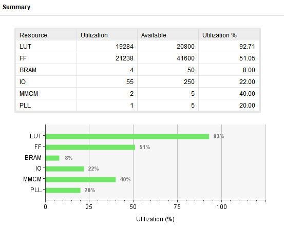

#### 功耗表现

| 功耗类型 | 数值 |
|---|---|
| **总功耗（Total On-Chip Power）** | **0.992 W** |
| 动态功耗（Dynamic Power） | 0.847 W（约 85.4%） |
| 静态功耗（Device Static） | 约 0.145 W（约 14.6%） |
| 结温（Junction Temperature） | 远低于硬件限制 |

动态功耗主要来自时钟网络翻转、AXI 总线信号切换及 BRAM 访存活动。无异常功耗热点。

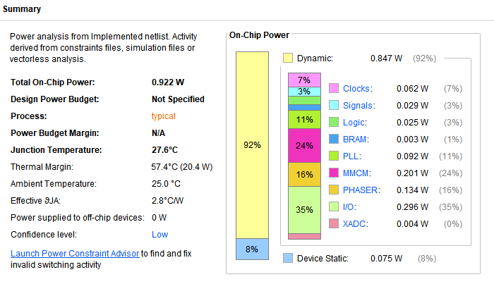

#### 静态时序分析（STA）

| 时序指标 | 数值 |
|---|---|
| **Worst Negative Slack (WNS)** | **+3.138 ns** |
| **Total Negative Slack (TNS)** | **0.000 ns** |
| Timing Violations | **0（全网无违例）** |

- 最坏延迟路径源端为系统时钟（周期 10.000 ns），终点为存储控制器物理层复位端
- 该路径实际总延迟仅 **1.862 ns**（逻辑延迟 0.751 ns + 布线延迟 1.111 ns）
- WNS = 10.000 ns - 1.862 ns = **+3.138 ns**，建立时间裕量极其充足
- TNS = 0 意味着全部路径均满足时序约束，无任何违例点

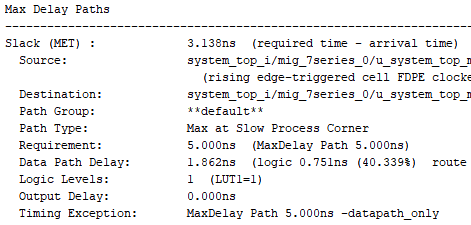

### 板级功能验证

- 成功通过烧录 `.bit` 配置文件至 FPGA
- 离线完成 SPI Flash 固件固化（`.mcs` 镜像写入），实现掉电不丢失
- 上电自动引导：BRAM Bootloader → SPI Flash 程序搬运 → PSRAM 执行
- UART 串口 **115200 bps** 连续无错输出启动日志与运行信息
成功运行程序输出串口打印。

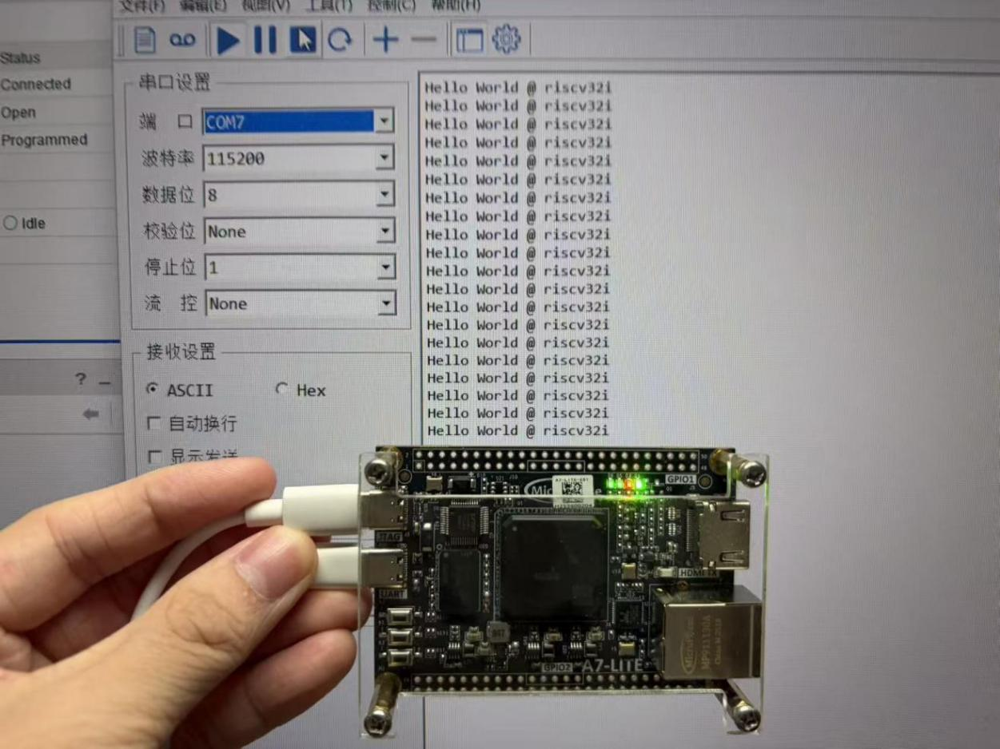