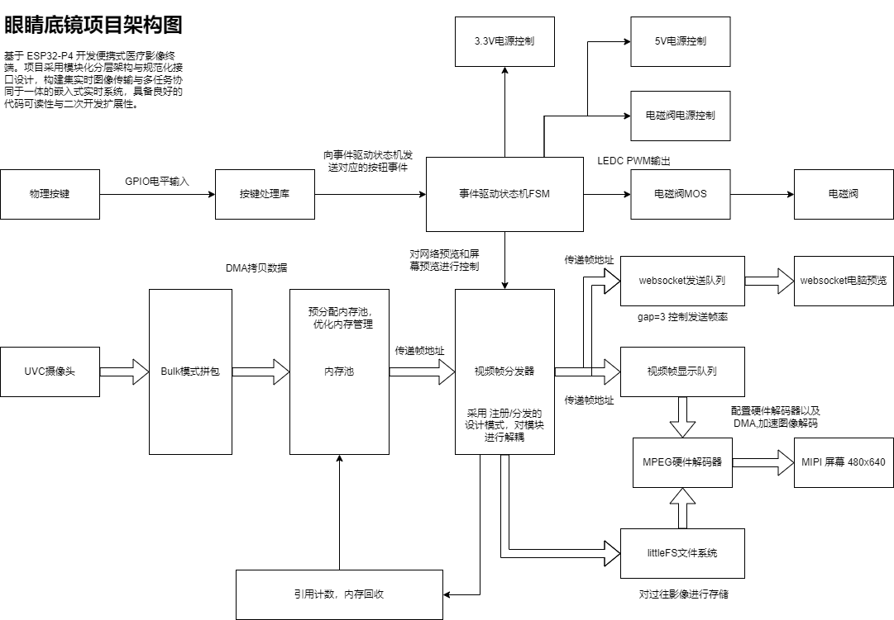
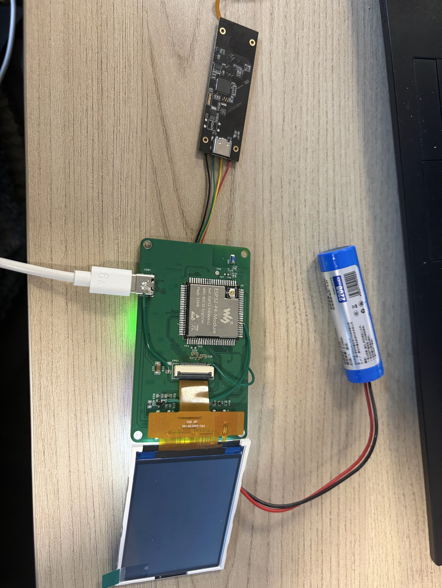
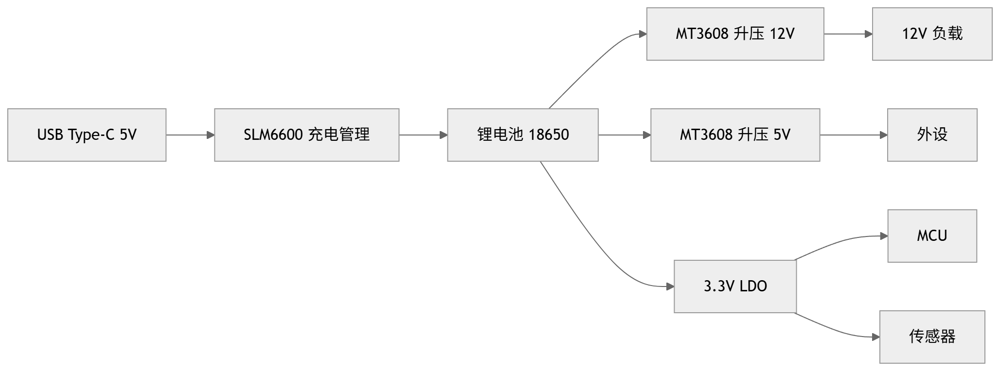
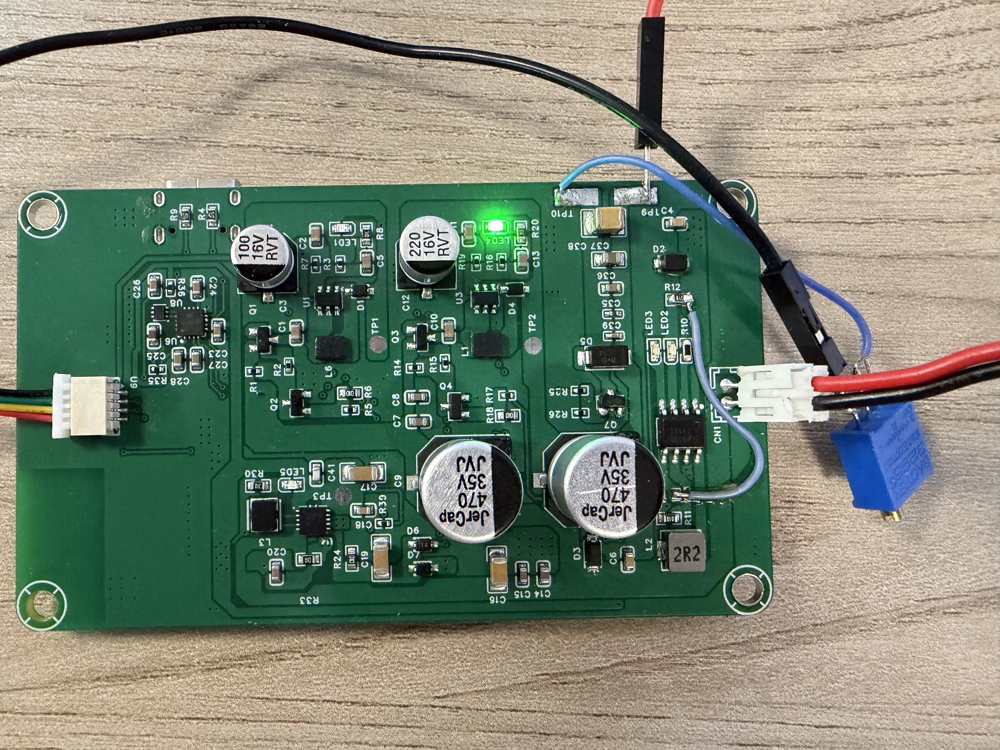

# 非接触式眼底镜

## 项目概述

一款用于基层医疗场景的非接触式眼底成像设备，通过实时视频流采集眼底图像，辅助医生观察子痫等高致死率疾病引发的眼部病变，实现早期筛查与干预。项目由盖茨基金会资助，我负责嵌入式软件开发以及原型机硬件的开发。

---

## 技术架构

**核心技术栈**：

| 层次 | 技术选型 |
|---|---|
| RTOS | FreeRTOS（多任务调度 + 资源管理） |
| 视频采集 | UVC 协议（USB Video Class） |
| 视频传输 | WebSocket（实时流推送） |
| 内存管理 | 自研 Buffer Pool + DMA 零拷贝 |
| 设计模式 | Observer（订阅/分发）· Singleton（单例） |
| 调试工具 | 逻辑分析仪 · 示波器 |
| 语言 | C（函数指针 / 位域 / 引用计数） |

---

### 高并发异步系统架构

**问题**：流媒体处理场景下，视频采集、编码、传输多任务并发执行，原始架构模块紧耦合，在高负载下出现资源竞态和死锁。

**方案**：
- 基于 FreeRTOS 重新构建流媒体处理框架
- 引入 **Observer（订阅/分发）模式** 实现模块解耦——视频采集模块作为 Publisher，编码和传输模块作为 Subscriber
- 使用 **Singleton（单例）模式** 管理全局资源池，避免重复初始化

**效果**：多线程竞态问题消除，系统在高并发场景下稳定运行。

---

### 视频流内存管理调优

**问题**：实时视频流频繁触发 `malloc/free`，导致严重的内存碎片化，且每帧数据在多个模块间拷贝传递，CPU 上下文切换开销过高。

**方案**：
- 独立设计 **基于指针传递的 Buffer Pool（缓冲池）** 管理机制
- 启动时**预分配**固定数量的大块内存缓冲区
- 缓冲区通过指针在各模块间传递，配合 **DMA 零拷贝** 技术规避 CPU 搬运数据
- 实现引用计数自动回收，防止内存泄漏

**效果**：内存碎片化减少，CPU 上下文切换开销降低，视频流帧率稳定。

---

### 底层驱动与协议栈重构

**问题**：原有 WebSocket 和 UVC 驱动代码耦合度高、可读性差，新增功能和排查 bug 困难。

**方案**：
- 使用 C 语言高级特性对驱动逻辑进行重构：
  - **函数指针**：实现协议状态机的可配置回调
  - **位域**：紧凑表达硬件寄存器映射，减少内存占用
  - **引用计数**：管理 UVC 帧缓冲的生命周期
- 负责底层软硬协同联调，验证协议栈在弱网、丢包、乱序等异常场景下的一致性

**效果**：代码可维护性提升，新增协议扩展时间从数天缩短至数小时。

---

### 全链路系统排障

**问题**：样机在特定工况下出现视频信号间歇性抖动，软件侧排查无果，怀疑为硬件问题。

**方案**：
- 使用**逻辑分析仪**捕获通信总线时序，确认协议层无异常
- 使用**示波器**逐级测量电源路径（DCDC → LDO），发现 DCDC 模块在负载突变时动态响应滞后，导致瞬时压降触发信号毛刺
- 与硬件工程师协同调整电源滤波方案，增加关键节点的去耦电容

**效果**：信号抖动消除，样机在高干扰环境下通信可靠。

---

### 电源树设计

**问题**：原型机采用单节 18650 锂电池供电（标称 3.7V，满电 4.2V），而系统各模块对电压需求差异显著——ESP32-P4 核心板需 3.3V，摄像头发射组件需 12V 驱动，USB/UVC 外设需 5V。如何在紧凑的便携设备内实现高效、低噪声的多路电源转换，是硬件设计的关键挑战。

**方案**：

- **Boost 升压级**：18650 电池经 Boost DC-DC 升压至 12V，和5V，为摄像头发射组件提供稳定驱动，以及摄像头外设供电
- **LDO 降压级**：18650 经 LDO 降压至 3.3V（MCU 及逻辑电路），采用这种隔离的方式主要使防止纹波导致单片机重启或故障
- **电源滤波与去耦**：在 DCDC 输出端、LDO 输入输出端就近布置去耦电容，抑制开关噪声；12V LED 回路单独走线，避免大电流脉动耦合至模拟前端

**效果**：稳定输出 3.3V/5V/12V 三路供电，满足各模块用电需求，成像信号链路不受电源噪声干扰。

